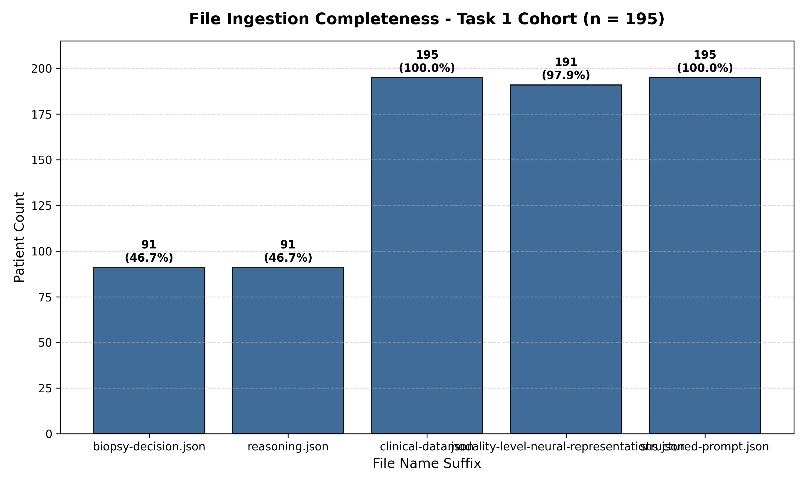
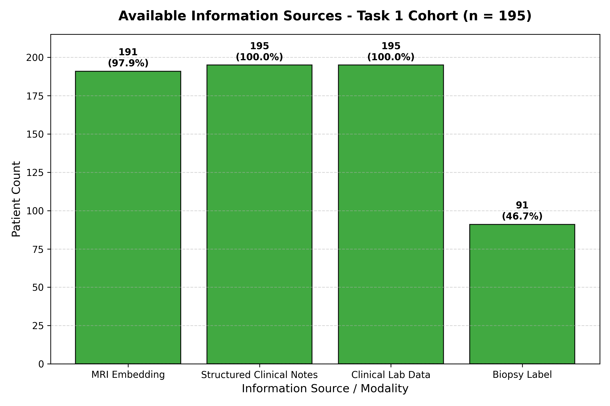

# Cohort Composition Summary Report — Task 1 (Biopsy Decision)

**Date**: 2026-07-20  
**Total Patient Folders Scanned**: 195  
**Labeled Cases (Train Partition)**: 91 (46.7%)  
**Unlabeled Cases (Test Partition)**: 104 (53.3%)  

## Target Variable Distribution (Labeled Split)
*   **`yes` (Requires Biopsy)**: 56 cases (61.5%)
*   **`no` (Do Not Biopsy)**: 35 cases (38.5%)

## File Completeness Audit

| File Name | Present Cases | Presence Rate (% of total) |
| :--- | :---: | :---: |
| `prostate-biopsy-decision.json` | 91 | 46.7% |
| `prostate-biopsy-decision-reasoning.json` | 91 | 46.7% |
| `prostate-biopsy-decision-clinical-data.json` | 195 | 100.0% |
| `prostate-modality-level-neural-representations.json` | 191 | 97.9% |
| `structured-prompt.json` | 195 | 100.0% |

## Modality Availability Audit

| Information Source | Present Cases | Presence Rate (% of total) | Notes |
| :--- | :---: | :---: | :--- |
| MRI Embedding | 191 | 97.9% | 4 cases missing (PT-pseudo_4bfd4ec864d8, PT-pseudo_4d54f04e26ae, PT-pseudo_7dbdcd6f9064, PT-pseudo_8636aa471ef7) |
| Structured Clinical Notes | 195 | 100.0% |  |
| Clinical Lab Data | 195 | 100.0% |  |
| Biopsy Label | 91 | 46.7% | Only available for labeled training split (91 cases) |

## Visualizations

### File Presence Completeness

### Available Modalities

