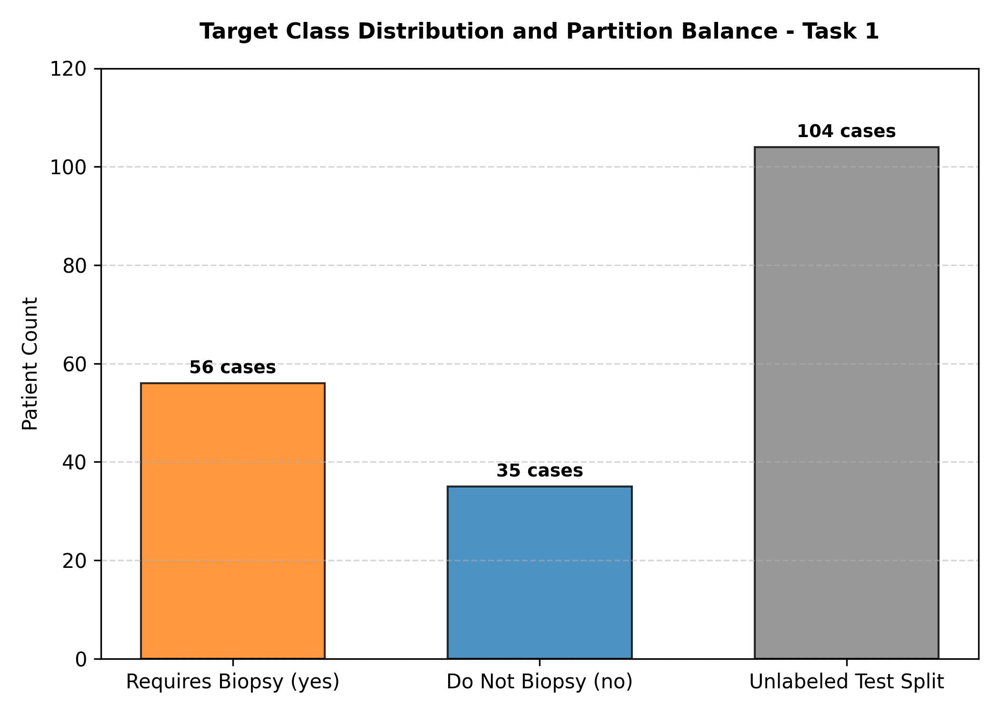
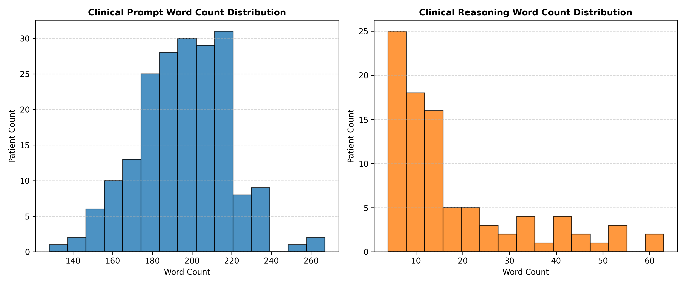
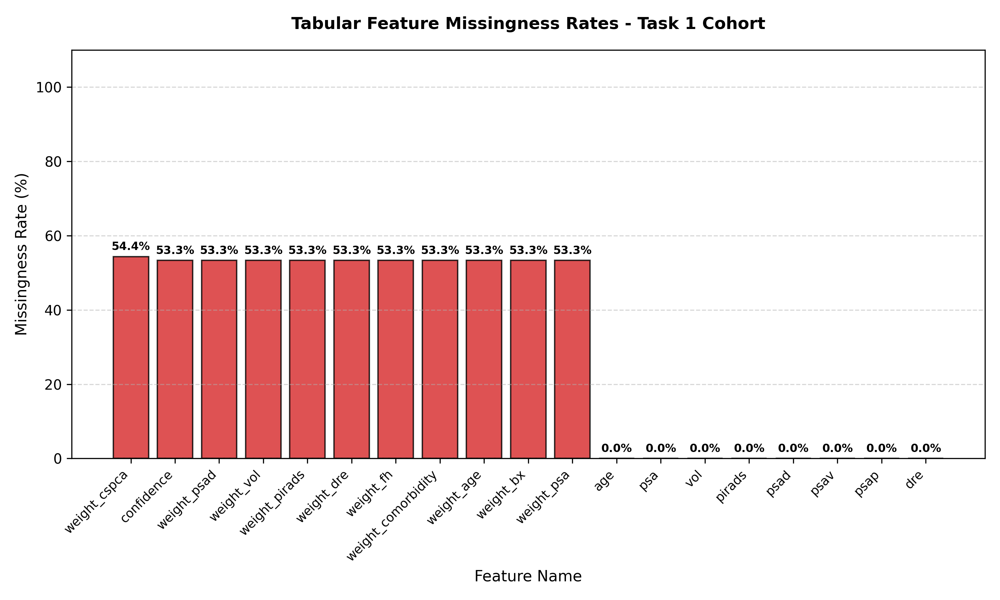
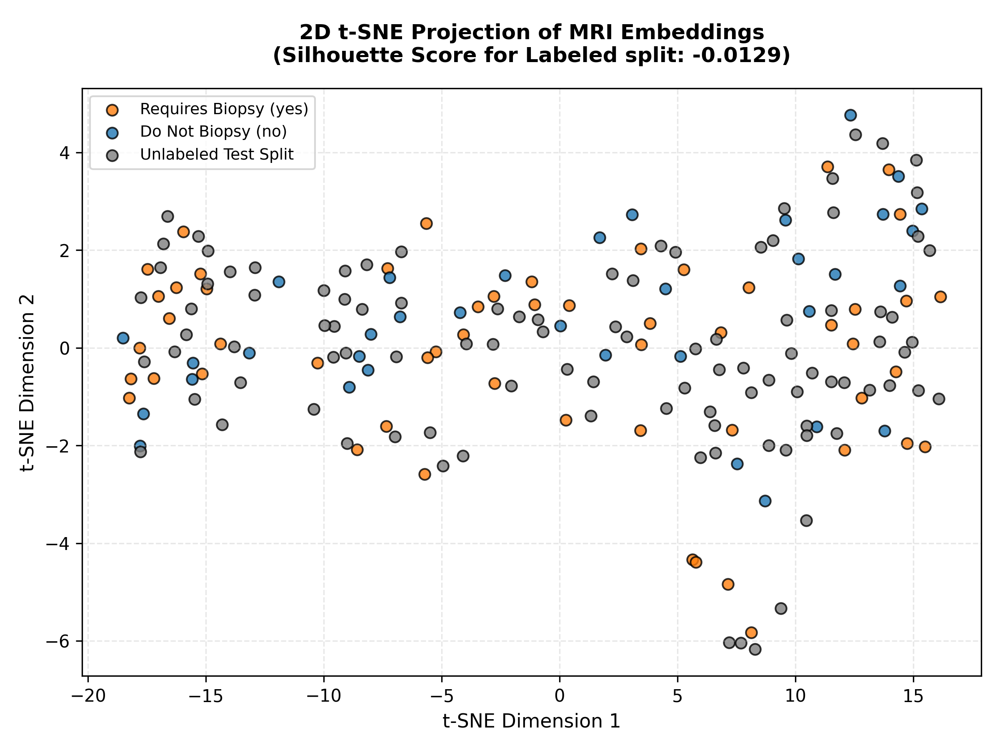

# Deep Exploratory Data Analysis Summary Report — Task 1

**Date**: 2026-07-20  
**Total Cases Scanned**: 195  
**Conda Environment**: `histo-DL`  

## Target Class Balance
*   **`yes` (Requires Biopsy)**: 56 cases
*   **`no` (Do Not Biopsy)**: 35 cases
*   **`unlabeled` (Test Split)**: 104 cases

## Text Word Count Distributions

| Narrative Source | Case Count | Min Words | Max Words | Mean Words | Median Words | Std Dev |
| :--- | :---: | :---: | :---: | :---: | :---: | :---: |
| Clinical Prompts | 195 | 128 | 267 | 196.0 | 197.0 | 22.9 |
| Clinical Reasoning | 91 | 4 | 63 | 17.8 | 12.0 | 14.5 |

## Tabular & Rationale Variable Missingness Rates

| Feature Variable | Source File | Missingness Rate (%) | Status |
| :--- | :---: | :---: | :--- |
| `weight_cspca` | `clinical_reasoning.csv` | 54.4% | Partially Missing |
| `confidence` | `clinical_reasoning.csv` | 53.3% | Test Split Padded (53.3% Missing) |
| `weight_psad` | `clinical_reasoning.csv` | 53.3% | Test Split Padded (53.3% Missing) |
| `weight_vol` | `clinical_reasoning.csv` | 53.3% | Test Split Padded (53.3% Missing) |
| `weight_pirads` | `clinical_reasoning.csv` | 53.3% | Test Split Padded (53.3% Missing) |
| `weight_dre` | `clinical_reasoning.csv` | 53.3% | Test Split Padded (53.3% Missing) |
| `weight_fh` | `clinical_reasoning.csv` | 53.3% | Test Split Padded (53.3% Missing) |
| `weight_comorbidity` | `clinical_reasoning.csv` | 53.3% | Test Split Padded (53.3% Missing) |
| `weight_age` | `clinical_reasoning.csv` | 53.3% | Test Split Padded (53.3% Missing) |
| `weight_bx` | `clinical_reasoning.csv` | 53.3% | Test Split Padded (53.3% Missing) |
| `weight_psa` | `clinical_reasoning.csv` | 53.3% | Test Split Padded (53.3% Missing) |
| `age` | `clinical_data_tabular.csv` | 0.0% | Standard (0.0% Missing) |
| `psa` | `clinical_data_tabular.csv` | 0.0% | Standard (0.0% Missing) |
| `vol` | `clinical_data_tabular.csv` | 0.0% | Standard (0.0% Missing) |
| `pirads` | `clinical_data_tabular.csv` | 0.0% | Standard (0.0% Missing) |
| `psad` | `clinical_data_tabular.csv` | 0.0% | Standard (0.0% Missing) |
| `psav` | `clinical_data_tabular.csv` | 0.0% | Standard (0.0% Missing) |
| `psap` | `clinical_data_tabular.csv` | 0.0% | Standard (0.0% Missing) |
| `dre` | `clinical_data_tabular.csv` | 0.0% | Standard (0.0% Missing) |

## MRI Embeddings t-SNE Clustering
*   **Unsupervised 2D t-SNE projection** was computed on the 191 cases with active MRI vectors.
*   **Silhouette Score (Labeled partition only)**: **-0.0129**
*   *Interpretation*: A Silhouette score of `-0.0129` (near 0) indicates that the 1024-D pre-extracted MRI embeddings exhibit significant class overlap when projected to 2D without visual labels. This emphasizes the mathematical necessity of fusing the MRI representations with structured tabular features (like PSA, age, and PI-RADS) or clinical prompt text to establish a discriminative classification boundary.

## Visualizations

### 1. Target Class Balance and Partition Distribution

### 2. Narrative Text Length Distributions

### 3. Feature Missingness (Absenteeism) Rates

### 4. MRI Embeddings t-SNE Projection

